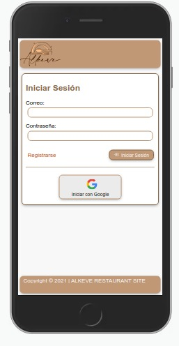

# Creando una Red Social

## Índice

* [1. Preámbulo](#1-preámbulo)
* [2. Resumen del proyecto](#2-resumen-del-proyecto)
* [3. Prototipos de baja y alta fidelidad](#3-prototipos-de-baja-y-alta-fidelidad)
* [4. Historias de usuario](#4-historias-de-usuario)
* [5. Producto final](#5-producto-final)

## 1. Preámbulo

Esta es una red social diseñada para cubrir la necesidad de un usuario que quiera compartir y promocionar información de su restaurante, donde las personas podrán hacer la publicación de su negocio o la visita de este, dando varias opciones al consumidor.

## 2. Resumen del proyecto

Alkeve es una Red social que permite compartir información sobre el restaurant del usuario, incluyendo horarios de apertura y cierre, los precios en la que oscilan sus platos y describir el en detalle su publicación. También tiene el usuario la oportunidad de interactuar con otras publicaciones, editar y borrar las propias para dinamizar el contenido o actualizarlo.

## 3. Prototipo de baja fidelidad

Para dar inicio del proceso, se diseñó una breve encuesta, con el fin de obtener ideas sobre el proyecto propuesto y así poder tener un base en la guía del desarrollo para la visualización de un posible usuario, quien dio su opinión en base a las preguntas realizadas sobre elementos para el diseño de la red social (colores, letra, iconos y datos personales).

Arrojando como resultado la preferencia en colores tierra, letra formal y el manejo de datos, que para el posible usuruario se sienta comodo y pueda usar la red social.

### Prototipo baja fidelidad

Desde el estudio y análisis de las encuestas, surge la primera idea reflejada en el prototipo de baja fidelidad, el cual recoge las ideas del equipo, en cuanto al proyecto de Alkeve, cubriendo la necesidad del usuario en base a los datos recolectados.

### Prototipos alta fidelidad

Pensando en la usabilidad y facilidad de acceso del usuario, se creo un prototipo de alta fidelidad, logrando una interfaz que permitirá acceder a todas las interacciones de la red social. 

## 4. Historias de usuario.

Se construyeron cinco historias pensadas en usuarios, interesados en dar a conocer su restaurante e informarse sobre tendencias y gastronomía basadas en sus platos, dentro de la comunidad. 

## 5. Producto final.

### 5.1 Vista registro

### 5.2 Vista Login

### 5.3 Inicio de sesión con Google

### 5.3 Post

### 5.3 Publicaciones

